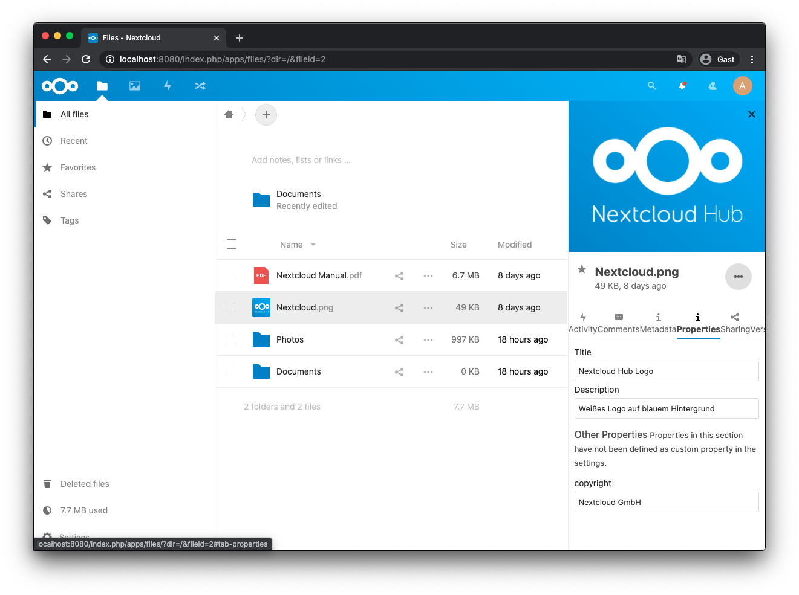
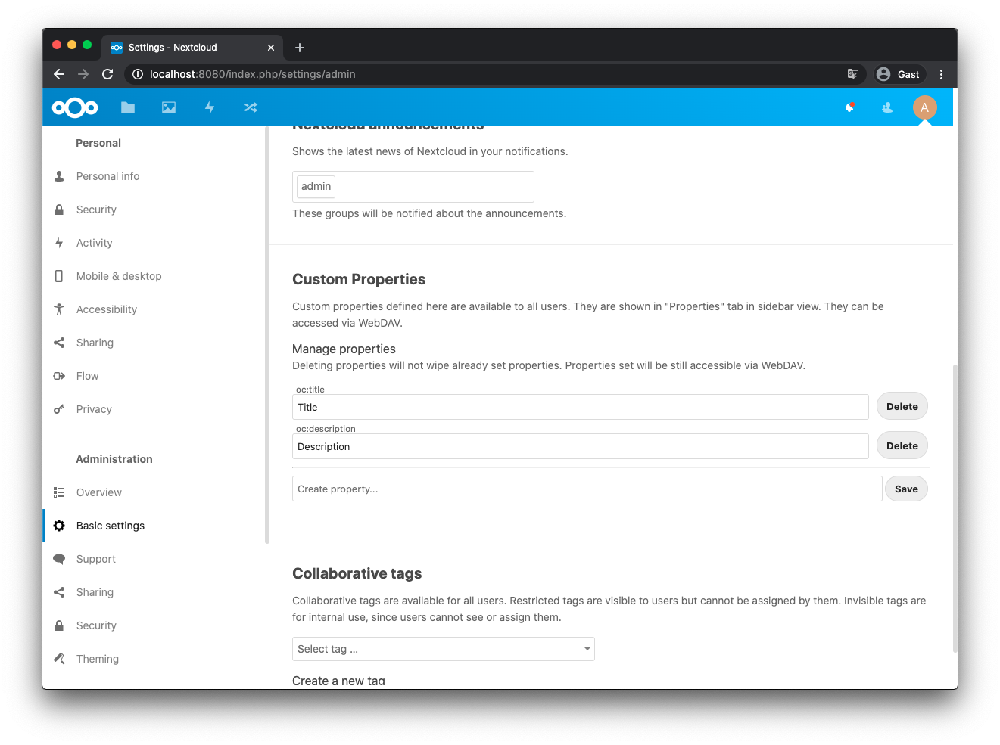

# Custom Properties
Place this app in **nextcloud/apps/customproperties**

## Usage
DAV's `PROPPATCH` request type allows adding custom properties to items.
Since custom properties are not accessible via the frontend, this plugin will list all properties of an item in the sidebar.
The plugin allows to define "well-known" properties in the admin settings which are presented as input fields in the "properties" tab in files app sidebar.
Changing the property in the tab will also change the DAV property and hence it will be possible to access the properties via DAV call `PROPFIND`.

## API
It is also possible to manage properties via Rest API (admin privileges required):

| Verb          | Endpoint                                              | Purpose                  |
| ------------- | ----------------------------------------------------- | ------------------------ |
| GET           | /index.php/apps/customproperties/customproperties     | Get properties   |
| PUT           | /index.php/apps/customproperties/customproperties     | Create new property      |
| POST          | /index.php/apps/customproperties/customproperties     | Update property      |
| DELETE        | /index.php/apps/customproperties/customproperties/:id | Delete existing property |

## Screenshots

